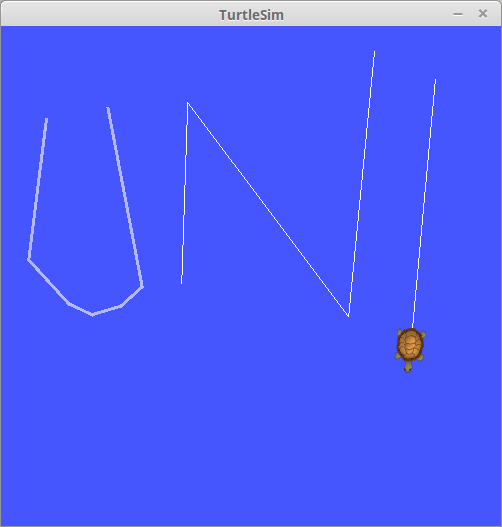
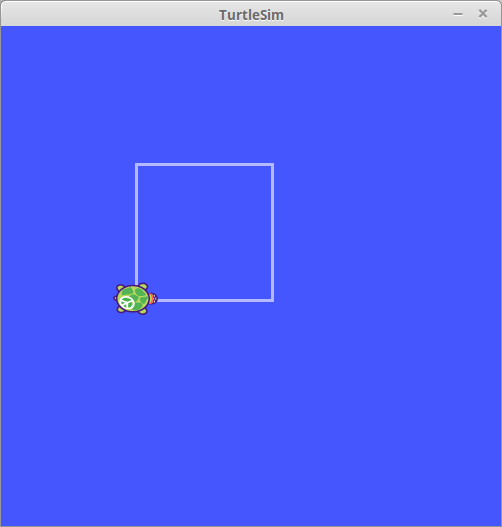
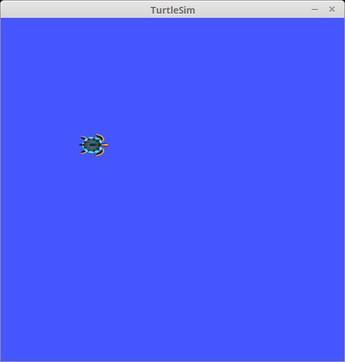
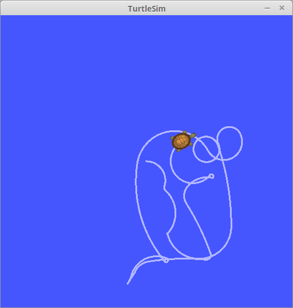

# Repository for Robbie 26 assignments

## Task 1: Turtle write letter

### Description
The `turtle_teleop_key` node publishes to the topic called *cmd_vel* of type `geometry_msgs/Twist`.
Using keyboard input we are able to navigate the turtle.

### Solution

First start roscore and start the turtlesim node by invoking:
```
$roscore
$rosrun turtlesim turtlesim_node
$rosrun turtlesim turtle_teleop_key

```

After the simulator is up and running, we call these services to reposition the turtle (x,y) and clearing it prior drawn lines:

```
$rosservice call /turtle1/teleport_absolute x y 0.0
$rosservice call /clear

```

Start moving the turtle and draw lines.
To switch the pen on and off we use the following call:

```
//draw using a white color and line weight 1

$rosservice call /turtle1/set_pen 255 255 255 1 1 //switching pen off
$rosservice call /turtle1/set_pen 255 255 255 1 0 //switching back on
```



## Task 2: Turtle drive square

### Description
The `turtlesim`node subscribes to the topic called *cmd_vel* of type `geometry_msgs/Twist`.
To make the turtle to swim a square, we have to publish messages to this topic.

### Solution

First start roscore and start the turtlesim node by invoking:
```
$roscore
$rosrun turtlesim turtlesim_node

```

After the simulator is up and running, we call these services to reposition the turtle and clearing it prior drawn lines:

```
$rosservice call /turtle1/teleport_absolute 3.0 5.0 0.0
$rosservice call /clear

```
Finally, we start moving and turning the turtle with

```
$rostopic /pub /turtle1/cmd_vel geometry_msgs/Twist [3.0,0.0,0.0] [0.0,0.0,0.0]
$rostopic /pub /turtle1/cmd_vel geometry_msgs/Twist [0.0,0.0,0.0] [0.0,0.0,1.56]
```

Repeat these commands three times and the square is finished!



## Task 3: Turtle rename

### Description
With ROS you can remap names within nodes with the following syntax: `old_name:=new_name`

### Solution

First start roscore:

```
$roscore

```

Then start the `turtlesim_node` with remapped service names:

```
$rosrun turtlesim turtlesim_node /turtle1/teleport_absolute:=/turtle1/beam_to /clear:=/clean_lines

```


Now teleporting the turtle and clearing the lines works as follows:

```
$rosservice call /turtle1/beam_to 3.0 7.0 0.0
$rosservice call /clear_lines
```



## Task 4: Triple turtle mimic

### Description
Using launchfiles it will be easy to handle the startup of multiple nodes and defining inter-node communication

### Solution

Just enter the following command and ROS will open a seperate terminal-window for the `turltle_teleop_key` node.


**Remarks: The launchfile tries to start some gnome preinstalled terminal emulator (Gnome Terminal). If you encounter some errors starting this launchfile, just replace the `launch-prefix=` attribute with your installed terminal emulator (e.g. xterm, rxvt, konsole).***


```
$roslaunch beginner_tutorials triple_turtlemimic.launch
```

## Task 5: Publish odd numbers

### Description

The service `talker` publishes odd numbers to the topic `oddNums` with the message type `num`.

Just start roscore, the message server `talker` and subscribe with the `listener` client.

```
$roscore
$rosrun beginner_tutorials talker
$rosrun beginner_tutorials listener
```

## Task 6: Two floats math

### Description

The `two_floats_math_server` computes to floats with a given operand provided by the `two_floats_math_client`.

### Solution

```
$roscore
$rosrun beginner_tutorials two_floats_math_server
$rosrun beginner_tutorials two_floats_math_client [float1] [float2] [operand]
```

**Remarks: The operand * should be enclosed with quotation-marks, otherwise the dash shell will interpret it as an wildcard-operator and makes an directory expansion.** 


## Task 7: Turtle random swimming

### Description

The node `turtle_random_swimming` publish random drive instructions (linear and angular) to the topic `turtle1/cmd_vel` which makes the turtle drive around. Collision avoidance is done by simply driving backwards and then randomly decide wheter to turn left or right.

### Solution

```
$roscore
$rosrun turlesim turtlesim_node
$rosrun turtle_random_swimming turtle_random_swimming
```

or just simply fire up the launchfile

```
$roslaunch turtle_random_swimming turtle_random_swimming
```




## Task 8: {Robot|Turtle} drive square ++
